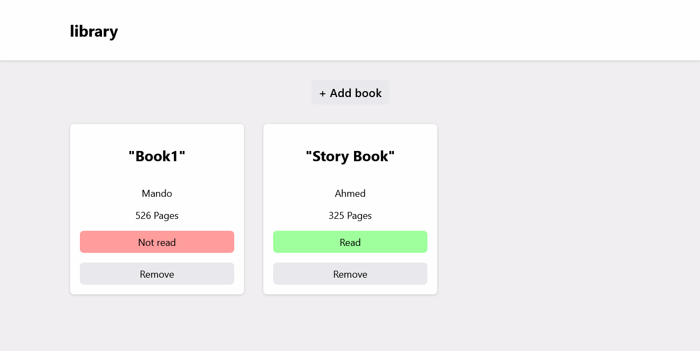
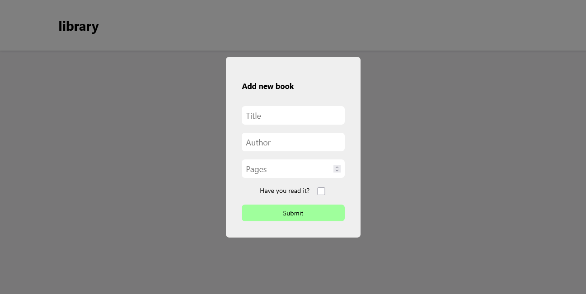
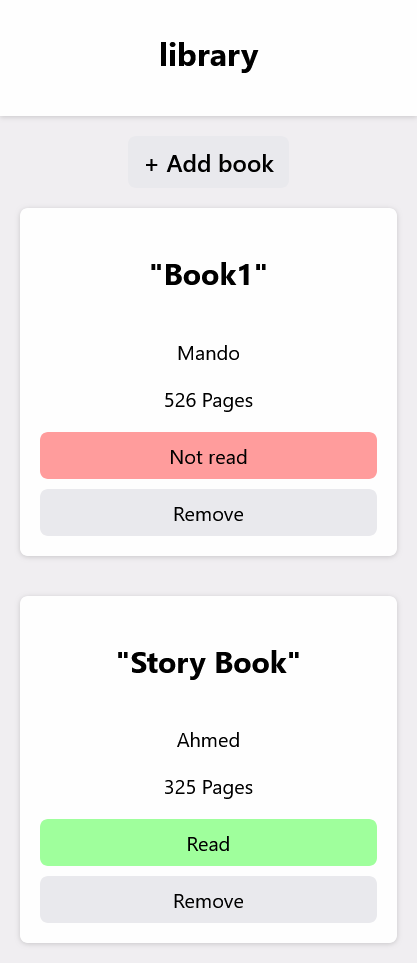

# 📚 Library App

A simple **Library Web App** built with **HTML, CSS, and JavaScript**.  
It allows you to add, remove, and manage books easily with **localStorage** support so your books stay saved even after refreshing the page.

🔗 **Live Demo:** [Library App](https://mahmoud25osama.github.io/Library/)

---

## 🚀 Features
- Add new books with **title, author, and number of pages**.
- Mark books as **Read / Not Read**.
- Remove books from the library.
- Data persistence using **localStorage**.
- Simple and clean UI design.

---

## 🛠️ Technologies Used
- **HTML5** for structure  
- **CSS3** for styling  
- **JavaScript (ES6+)** for functionality  

---

## 📷 Screenshot


### ➕ Add Book Form


### 📱 Mobile Responsive


---

## 📦 How to Use
1. Clone the repo:
   ```bash
   git clone https://github.com/mahmoud25osama/Library.git
    ````

2. Open the project folder:

   ```bash
   cd Library
   ```
3. Open `index.html` in your browser.

---

## ✨ Future Improvements

* Add book search & filter.
* Support book editing.

---

## 👨‍💻 Author

**Mahmoud Osama**
🔗 [GitHub Profile](https://github.com/mahmoud25osama)

---
